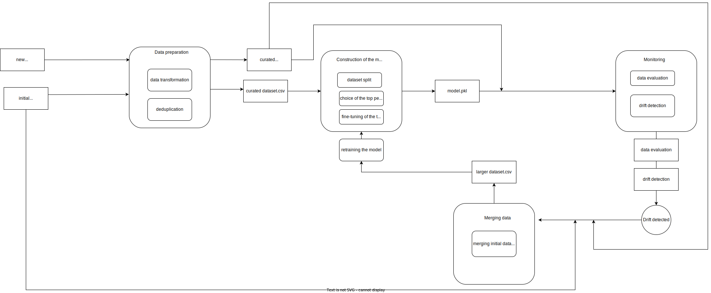

# ASI_project_s2002
# Table of contents
## 1. [General](#general)
## 2. [Architecture](#architecture)
## 3. [Instruction](#instruction)
## 4. [Authors](#authors)

## 1. General 
The application was clasifies whether a given wine is classfied as 'good' or 'bad' based on 62 decriptors. It can support non-expert customers to select quqlity wine. It can be used as a stand-alone application or incorporated as a component of a larger platform. 

The application the application works in a looped pipeline that monitors performance of the machine learning model and retraines and updates it on the fly if a data drift is dtected. 

Data to construct machine learning model were downlowaded from Kaggle. It can be accessed under the following link:

## 2. Architecture 
The architecture of the application is described by the diagram shown in the Figure 1.

The program can be divided into the following stages:

1.preparation of initial dataset</n>
2.training of the model
3.evaluation and drift detection on new data
4.augmentation of the dataset by incorporation of the new datapont
5.retraining and updating the model

Ponits 2 to 5 are in a loop which causes the model to be  constantly updated.

## 3.Installation 

Clone this repository:

git clone https://github.com/s20002-pjatk/ASI_project_s2002.git

The easiest way to run the application is to use Anaconda Navigator. It can be download from: https://anaconda.org/ 

After installation of the anaconda software, create a new virtual evironment using either Anaconda Navigator or Anaconda Prompt.
In case of using Anaconda prompt the user should type in the following command:

$ conda create --name ASI python=3.8.13 -y

The next step is to activate the new environmet. It can be done by typing in the fllowing command in Anaconda Prompt:

$ C:\Users\saras>conda activate ASI

In order to run the application it is neccessary to install the following libraries:
numpy==1.19.5
pandas==1.4.2
pycaret==2.3.10
  
they can be  installed in the virtual environment by typing in Anaconda Prompt:

$ pip install library==X.XX.X

To run the application, the userr has to type in  Anaconda Prompt the following command:
$ python wine_classifier_mod2.py

Make sure that Anaconda Prompt points the correct location where the file is stored. 

In case of evaluating new data, they should be stored in the data folder and named "batch_no.csv".

  
## 4. Authors 
Sara Szymkuć is the only author of the application.
